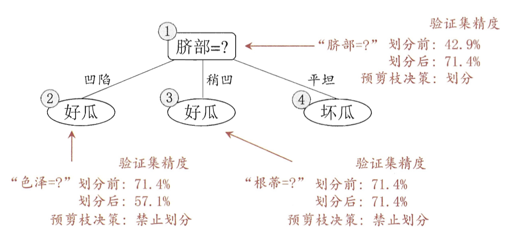

# 预剪枝

基于信息增益准则，我们首先选选取“脐部“对训练集进行划分，产生来三个分支，如图所示。

然后是否在这个基础上继续进行划分呢，就要用到模型评估。

假设对于第一个节点，我们不进行划分，直接将它算作叶节点的话，那么他的类别就是训练集合中数量最多的种类，就是好瓜，那么我们在验证数据上验证一下其精度，其中编号$$\{4,5,8\}$$，分类正确，其余四个分类错误，所以其精度为$$\frac{3}{7} \times 100 \%=42.9 \%$$.

在用属性脐部划分之后，上图中的节点2，3，4分别包含编号为{1,2,3,14},{6,7,15,17},{10,16}的训练样例。因此这三个节点被标记为叶节点“好瓜“，“好瓜“，“坏瓜“。此时，在验证数据集中编号为{4，5，8，11，12}的样例被划分正确，此时验证集的精度为，于是，使用“脐部“划分是正确的。

